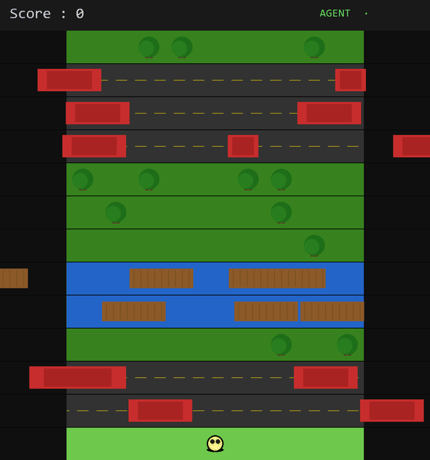
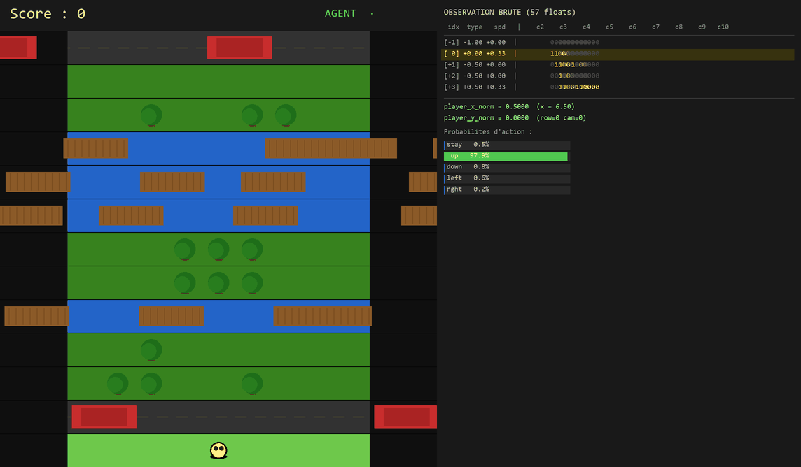

<h1 align="center">CrossyBot</h1>

<p align="center">
  <b>Agent d'apprentissage par renforcement entraîné à jouer à un clone de Crossy Road</b><br/>
  PPO implémenté from scratch en PyTorch pur &bull; Inférence temps réel en JS pur dans le navigateur
</p>

<p align="center">
  
  
  
  
</p>

---

## Démo

### L'agent joue en autonome

<p align="center">
  
</p>

> L'agent PPO navigue à travers les routes, rivières et herbe en prenant 3 décisions par seconde.
> Entraîné pendant 165M de steps sur CPU (~90K paramètres).

### Mode Debug — ce que voit le réseau de neurones

<p align="center">
  
</p>

> Le panneau de droite affiche le vecteur d'observation brut (57 floats) passé au réseau,
> ainsi que les probabilités de chaque action en temps réel.

### Version Web 3D (Three.js)

<p align="center">
  
</p>

> Le même modèle est exporté en JSON et tourne en **inférence JS pure** dans le navigateur — aucune dépendance IA côté client, < 1 ms par décision.

---

## Points techniques

| | |
|---|---|
| **PPO from scratch** | Implémentation complète en PyTorch pur — pas de Stable-Baselines, pas de RLlib. Buffer GAE, surrogate clippé, bonus d'entropie, gradient clipping. |
| **Environnement custom** | Clone de Crossy Road construit avec Gymnasium. Génération procédurale par tables de probabilités évoluant avec le score, validation BFS de la traversabilité. |
| **Inférence JS pure** | Le réseau (~90K params) est exporté en JSON et reconstruit manuellement en JavaScript — aucune dépendance externe, < 1 ms par décision. |
| **Double version** | Python/Arcade pour l'entraînement + Web/Three.js pour la démo 3D. Physique identique dans les deux versions. |
| **Modèles 3D custom** | Assets GLB modélisés dans Blender : joueur, 4 variantes de voitures, 4 tailles de bûches, 4 types d'arbres, nénuphars. |

---

## Installation

### Entraînement (Python)

```bash
pip install gymnasium numpy torch arcade wandb
```

### Version web

```bash
cd web
npm install
```

---

## Utilisation

### Jouer manuellement

```bash
python play.py
```

Contrôles : `↑ ↓ ← →` pour se déplacer &nbsp;|&nbsp; `R` pour rejouer

### Faire jouer l'agent entraîné

```bash
python play.py --agent training/models/crossybot.pt
```

`A` pour basculer entre agent et humain en cours de partie.

### Mode debug — observer ce que voit le réseau

```bash
python play.py --debug --agent training/models/crossybot.pt
```

Affiche le vecteur d'observation brut (57 floats) et les probabilités d'action du réseau. `ESPACE` pour avancer d'un step, flèches pour choisir l'action manuellement.

### Lancer l'entraînement

```bash
python train.py
python train.py --updates 3000 --envs 16 --steps 512 --ent-coef 0.05
python train.py --load training/models/crossybot.pt --updates 1000
python train.py --no-wandb
```

`Ctrl+C` sauvegarde le modèle proprement avant de quitter.

### Déployer dans la version web

```bash
python export_model.py                   # exporter les poids → web/assets/crossybot.json
cd web && npm run dev                    # lancer le serveur de dev
```

Ouvrir le navigateur et cliquer sur **Mode IA** pour observer l'agent jouer en 3D.

---

## Environnement

Grille de **13 colonnes** &times; hauteur infinie. Les colonnes 0-1 et 11-12 sont des murs (mort immédiate). Zone jouable : colonnes 2 à 10.

Le jeu défile automatiquement à **0.5 rangée/sec** — le joueur doit avancer en permanence sous peine d'être rattrapé.

| Type de lane | Comportement |
|:---:|---|
| **Herbe** | Arbres statiques bloquants — le joueur ne peut pas les traverser |
| **Route** | Voitures en flux continu (vitesse variable) — mort par collision |
| **Eau** | Bûches en flux continu — le joueur doit sauter dessus, sinon il se noie |
| **Nénuphars** | Plateformes statiques — le joueur doit atterrir dessus |

La difficulté augmente avec le score : sections plus longues, obstacles plus rapides, moins de pauses herbeuses.

### Observation de l'agent

Vecteur de **57 floats** passé au réseau à chaque step :

```
5 lanes × 11 valeurs :
  ├── type de lane (encodé en float -1.0 à +1.0)
  ├── vitesse normalisée (-1.0 à +1.0)
  └── occupation des 9 colonnes jouables (0.0 à 1.0 chacune)
+ 2 valeurs :
  ├── position X du joueur (normalisée)
  └── position Y du joueur (normalisée)
```

**Actions** : 5 actions discrètes — rester, avancer, reculer, gauche, droite.

**Récompenses** : `+1` par nouveau record de ligne | `-0.1` par step sans progression | `-1` à la mort.

---

## Architecture du réseau

```
                          obs (57,)
                             │
               ┌─────────────┴─────────────┐
               │                           │
        lanes (5, 11)                   player_pos (2,)
               │                           │
    ┌──── LaneEncoder ─────┐               │
    │  (partagé × 5 lanes) │               │
    │  Linear(11 → 64)     │               │
    │  ReLU                │               │
    │  Linear(64 → 32)     │               │
    │  ReLU                │               │
    └──────────────────────┘               │
               │                           │
        flatten (160,)                     │
               │                           │
               └──────── concat ───────────┘
                           │
                        (162,)
                           │
                    Linear(162 → 256)
                         ReLU
                    Linear(256 → 128)
                         ReLU
                           │
              ┌────────────┴────────────┐
              │                         │
       Policy Head                 Value Head
    Linear(128 → 5)             Linear(128 → 1)
              │                         │
     logits → Categorical           V(s) scalaire
```

- **~90 000 paramètres** — assez petit pour s'entraîner sur CPU
- **LaneEncoder partagé** : le même réseau est appliqué à chaque lane, ce qui encode l'hypothèse que toutes les lanes obéissent aux mêmes règles physiques
- **Initialisation orthogonale** sur toutes les couches (détail critique pour la stabilité PPO)

---

## Algorithme PPO

[Proximal Policy Optimization](https://arxiv.org/abs/1707.06347) (Schulman et al., 2017) avec les composants suivants :

- **GAE** (Generalized Advantage Estimation) : compromis biais/variance avec &gamma;=0.99 et &lambda;=0.95
- **Surrogate clippé** : limite les mises à jour de la politique (&epsilon;=0.2)
- **Bonus d'entropie** : maintient l'exploration (coef=0.05)
- **Gradient clipping** : stabilise l'entraînement (max_norm=0.5)
- **16 environnements parallèles** via `gymnasium.vector.AsyncVectorEnv`

### Hyperparamètres par défaut

| Paramètre | Valeur | Rôle |
|-----------|--------|------|
| `n_envs` | 16 | Environnements parallèles pour la collecte |
| `n_steps` | 512 | Steps collectés par env par update |
| `n_epochs` | 4 | Passes sur les données par update |
| `batch_size` | 256 | Taille des mini-batchs |
| `lr` | 3&times;10⁻⁴ | Learning rate (Adam) |
| `gamma` | 0.99 | Facteur de discount |
| `gae_lambda` | 0.95 | Paramètre GAE |
| `clip_range` | 0.2 | Clipping PPO |
| `ent_coef` | 0.05 | Coefficient d'entropie |

### Métriques WandB à surveiller

| Métrique | Comportement attendu |
|---|---|
| `perfs/reward_mean` | Augmente progressivement |
| `losses/entropy` | Reste > 0 (exploration maintenue) |
| `ppo/clip_fraction` | Entre 0.05 et 0.30 |
| `losses/value` | Diminue (le critic apprend V(s)) |

---

## Génération procédurale

L'environnement est généré de façon procédurale avec des **tables de probabilités** qui évoluent avec le score du joueur :

- **Structure des sections** : alternance herbe / route / rivière, avec une probabilité croissante d'enchaîner les sections dangereuses
- **Vitesse des obstacles** : augmente progressivement avec le score
- **Taille des groupes** : les sections de route et de rivière deviennent plus longues
- **Validation automatique** : BFS sur les sections d'herbe pour garantir la traversabilité, connectivité des nénuphars vérifiée

Chaque table est définie par tranches de score, ce qui permet un contrôle fin de la courbe de difficulté.

---

## Pipeline Python → Web

```
┌──────────────┐     ┌───────────────┐     ┌──────────────────────────┐
│  train.py    │     │export_model.py│     │  web/src/ai/agent.js     │
│              │     │               │     │                          │
│  PyTorch     │────>│  Sérialise    │────>│  Reconstruit le réseau   │
│  .pt (dict)  │     │  en JSON      │     │  en JS pur (Float32Array)│
│              │     │               │     │  < 1 ms par inférence    │
└──────────────┘     └───────────────┘     └──────────────────────────┘
```

Les poids sont aplatis en row-major (layout natif PyTorch) et rechargés dans des `Float32Array`. L'inférence reconstruit manuellement les couches `Linear` + `ReLU` — aucune dépendance à TensorFlow.js ou ONNX.js.

---

## Structure du projet

```
CrossyBot/
├── train.py                        # Point d'entrée entraînement (CLI)
├── play.py                         # Version jouable Arcade (humain / agent / debug)
├── export_model.py                 # Export poids PyTorch → JSON pour le web
│
├── training/
│   ├── env/
│   │   ├── crossy_env.py           # Environnement Gymnasium (CrossyEnv)
│   │   ├── lane.py                 # Logique d'une ligne (types, collision, flux)
│   │   └── generation_config.py    # Tables de génération procédurale
│   │
│   ├── agent/
│   │   ├── network.py              # Architecture ActorCritic (LaneEncoder + MLP)
│   │   ├── rollout.py              # Buffer de collecte + calcul GAE
│   │   ├── ppo.py                  # Mise à jour PPO (surrogate clippé)
│   │   └── trainer.py              # Boucle d'entraînement + logging WandB
│   │
│   └── models/
│       └── crossybot.pt            # Checkpoint du modèle entraîné
│
└── web/                            # Version Three.js (démo 3D)
    ├── index.html
    ├── package.json                # Vite + Three.js
    ├── assets/                     # Modèles GLB (Blender) + crossybot.json
    └── src/
        ├── main.js                 # Boucle d'animation, inputs, scroll, mode IA
        ├── ai/
        │   └── agent.js            # Inférence JS pure (~90K params, < 1 ms)
        ├── game/
        │   ├── constants.js        # Constantes partagées
        │   ├── env.js              # CrossyEnv JS (physique identique au Python)
        │   ├── generationConfig.js # Génération procédurale (miroir Python)
        │   └── lane.js             # Lane JS (mêmes propriétés)
        └── renderer/
            ├── scene.js            # Scène Three.js, caméra ortho, ombres PCF
            ├── gameView.js         # Rendu 3D, animation de saut, caméra suivi
            └── modelLoader.js      # Chargement des modèles GLB
```

---

## Licence

Ce projet est un projet personnel à but éducatif.
